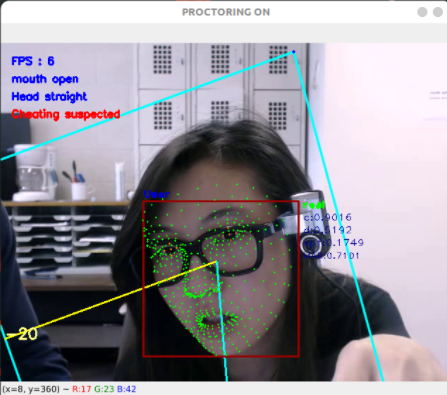

# Robust Automated Proctoring System for Online Examinations

- This application proctors examinee continuously throughout the exam using webcam and detects several methods of cheating with high accuracy and makes report of their cheating behaviour. 
- It has modules like Face detection, Face recognition, Face landmarks detection, Head pose estimation, Face spoof detection and Lips tracker.
- This application uses less cpu and RAM because we used robust and light weight models like BlazeFace face detector, FaceNet for face recogntion.
- Our application detects the following cheating methods:
  1. Another person giving exam
  2. Another person helping by sitting beside or talking in the same camera frame
  3. Student going away from device abnormal number of times
  4. Student talking to someone (including on phone)
  5. Student staring away from screen abnormal number of times (staring out of screen, staring down for accessing mobile or a book)
  6. Student spoofing his presence

### Dataset: 
OEP dataset is used for testing which can be downloaded from here(http://cvlab.cse.msu.edu/oep-dataset.html)

### Results:
Our proctoring system has scored 95.3% accuracy whereas basline accuracy is 93.4%.
 A glimpse of live proctoring on test dataset:  

  
  
  

### Setup Instructions
1. First download this project. We used anaconda environments to manage dependencies for this project, so download anaconda installer from <a href="https://www.anaconda.com/products/individual#Downloads">here</a>.</li>
2. Open anaconda prompt and go to the assets directory of this project where proctorenv.yml is there.
3. Type in anaconda prompt: conda env create -f proctorenv.yml
4. Now a conda environment called "proctorenv" is created. To activate this env, type: conda activate proctorenv
5. After activating proctorenv env, go to the directory which has main.py of this project. Type: python main.py to start the proctoring system.
6. First register yourself on the first screen by pressing `r` to capture you images for 5 times.
7. Now proctoring will begin and it will end after you press the `esc` key.
8. The reports generated will be stored in the `./results` folder.
